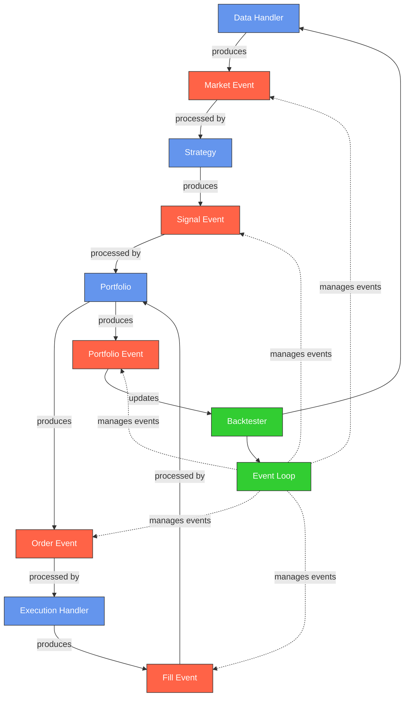

# Backtesting System

An event-driven backtesting framework for cryptocurrency trading strategies.

## System Architecture

## Overview

This backtesting system implements an event-driven architecture for simulating trading strategies on historical cryptocurrency data. The main components include:

- **Data Handler**: Provides market data from Binance or other exchanges via CCXT
- **Strategy**: Analyzes market data and generates trading signals
- **Portfolio**: Tracks positions, cash, and equity over time
- **Execution Handler**: Simulates order execution with commission and slippage
- **Event Loop**: Manages the flow of events through the system
- **Backtester**: Coordinates the components and calculates performance metrics

## Event Types

The system processes several types of events:

1. **Market Events**: New price data from the market
2. **Signal Events**: Buy/sell signals generated by strategies
3. **Order Events**: Orders created from signals
4. **Fill Events**: Executed orders with fill price and commission
5. **Portfolio Events**: Updated portfolio state after fills
