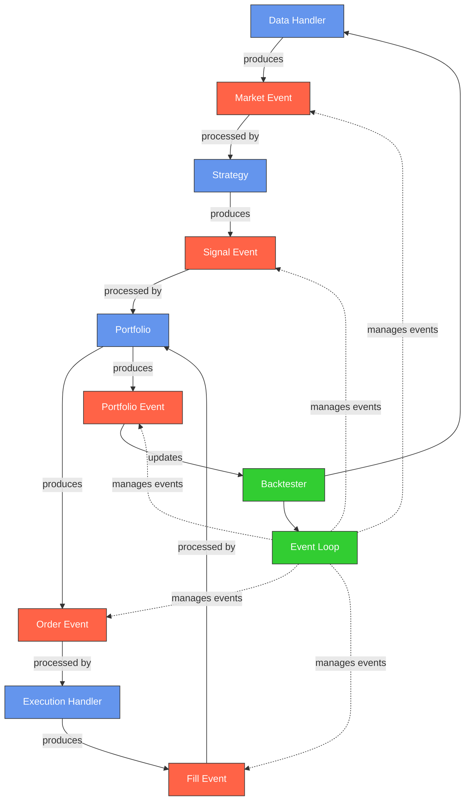

# Backtesting System

An event-driven backtesting framework for cryptocurrency trading strategies.

## System Architecture



## Overview

This backtesting system implements an event-driven architecture for simulating trading strategies on historical cryptocurrency data. The main components include:

- **Data Handler**: Provides market data from Binance or other exchanges via CCXT
- **Strategy**: Analyzes market data and generates trading signals
- **Portfolio**: Tracks positions, cash, and equity over time
- **Execution Handler**: Simulates order execution with commission and slippage
- **Event Loop**: Manages the flow of events through the system
- **Backtester**: Coordinates the components and calculates performance metrics

## Event Types

The system processes several types of events:

1. **Market Events**: New price data from the market
2. **Signal Events**: Buy/sell signals generated by strategies
3. **Order Events**: Orders created from signals
4. **Fill Events**: Executed orders with fill price and commission
5. **Portfolio Events**: Updated portfolio state after fills

## AI-Driven Components

The system includes AI-driven components for enhancing the backtesting process:

### Strategy Parser Module

The Strategy Parser Module allows users to define trading strategies in natural language, which are then parsed into structured representations for code generation and backtesting.

Two parsing methods are available:

1. **Rule-Based Parser**: Uses regular expressions to extract technical indicators, entry/exit rules, and risk management parameters from strategy descriptions.

2. **LLM-Based Parser**: Utilizes Large Language Models (OpenAI's GPT-4) to interpret more complex and nuanced strategy descriptions, handling a wider variety of inputs and providing more accurate parsing.

Example usage:

```python
from ai_driven.parser import parse_strategy

# Rule-based parsing
strategy_spec = parse_strategy(
    "Buy when the 10-day SMA crosses above the 30-day SMA, and sell when RSI(14) goes above 70. Use a 2% stop loss."
)

# LLM-based parsing (requires OpenAI API key)
llm_strategy_spec = parse_strategy(
    "Strategy name: Triple Screen System. Buy when weekly trend is up, daily MACD histogram is positive and RSI(14) is above 50. Sell when weekly trend turns down or RSI(14) is above 70.",
    use_llm=True,
    api_key="your_openai_api_key"  # Optional, can use OPENAI_API_KEY environment variable
)

# Access parsed components
print(f"Strategy: {llm_strategy_spec.name}")
print(f"Indicators: {llm_strategy_spec.indicators}")
print(f"Entry rules: {llm_strategy_spec.entry_rules}")
```

### Testing the Parser

The system includes test scripts for both parsers:

```bash
# Test rule-based parser
python -m ai_driven.test_parser

# Test LLM-based parser
python -m ai_driven.test_llm_parser
```

You can also test with a specific strategy description:

```bash
python -m ai_driven.test_parser -d "Buy when price crosses above 20-day SMA. Sell when RSI is over 70."

python -m ai_driven.test_llm_parser -d "Buy when MACD histogram turns positive and price is above 50-day EMA. Sell when price falls 5% from peak. Use 2% of account per trade."
```
