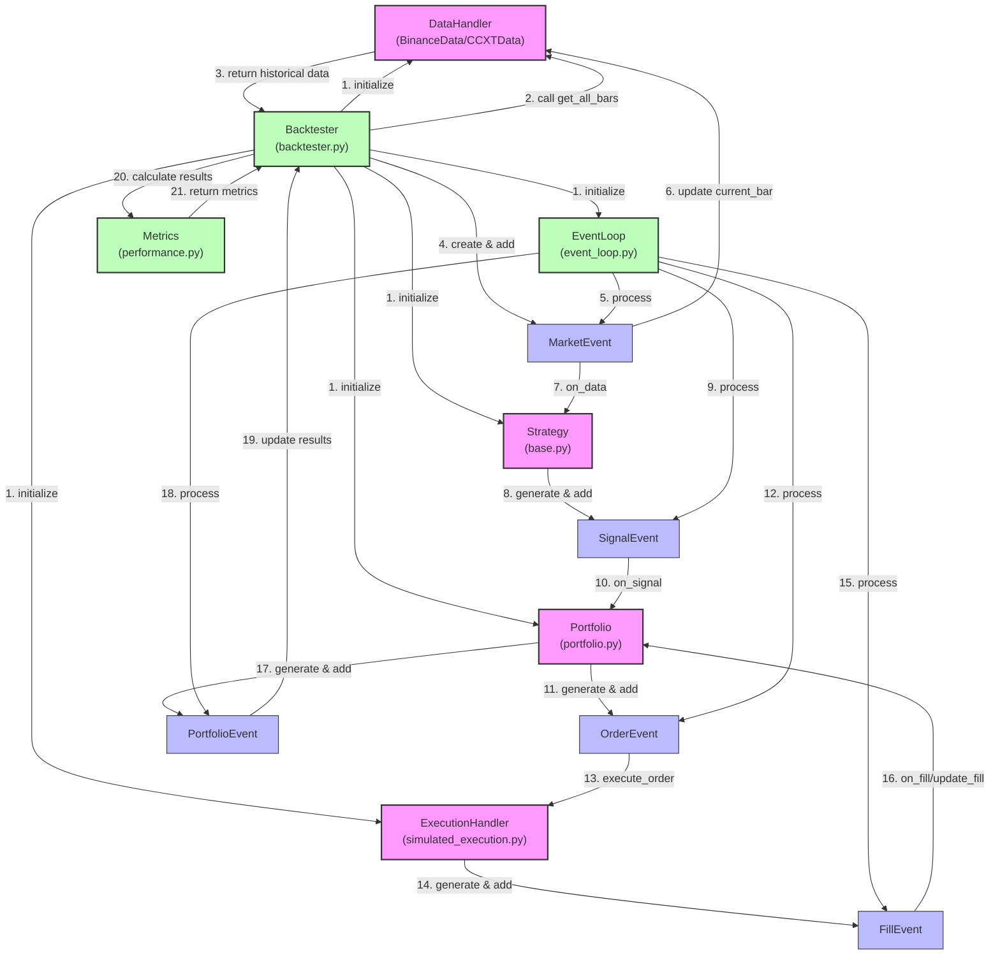

# Crypto Trading Backtesting System

A Python-based backtesting system for crypto trading strategies, designed for individual traders and quant engineers.



## Overview

This system allows you to:
- Fetch historical cryptocurrency data (initially from Binance)
- Backtest trading strategies on historical data
- Implement technical indicator-based or machine learning-based strategies
- Evaluate performance with standard metrics (Sharpe ratio, drawdown, win rate)
- Run backtests via command line or Python API

## Project Structure

```
backtesting-system/
├── backtesting/             # Main package
│   ├── data/                # Data handling modules
│   ├── engine/              # Backtesting engine core
│   ├── broker/              # Order execution simulation
│   ├── strategy/            # Strategy interface and examples
│   ├── portfolio/           # Portfolio tracking
│   └── metrics/             # Performance metrics
├── cli/                     # Command-line interface
├── examples/                # Example strategies
└── tests/                   # Unit tests
```

## Installation

```bash
# Clone the repository
git clone https://github.com/yourusername/backtesting-system.git
cd backtesting-system

# Install dependencies
pip install -r requirements.txt
```

## Usage

```bash
# Run a backtest with an example strategy
python -m cli.backtest_cli --strategy examples.simple_ma_cross.MovingAverageCrossStrategy --symbol BTCUSDT --start 2022-01-01 --end 2022-12-31
```

## Creating Custom Strategies

Inherit from the base Strategy class:

```python
from backtesting.strategy.base import Strategy

class MyCustomStrategy(Strategy):
    def init(self):
        # Setup indicators, models, etc.
        self.sma_short = self.data['close'].rolling(window=50).mean()
        self.sma_long = self.data['close'].rolling(window=200).mean()
        
    def next(self):
        # Trading logic for each new price bar
        if self.sma_short[-1] > self.sma_long[-1] and self.sma_short[-2] <= self.sma_long[-2]:
            self.buy()
        elif self.sma_short[-1] < self.sma_long[-1] and self.sma_short[-2] >= self.sma_long[-2]:
            self.sell()
```

## License

MIT
