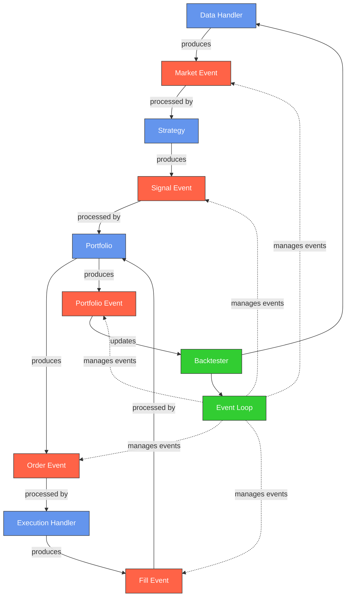

# Backtesting System

An event-driven backtesting framework for cryptocurrency trading strategies.

## System Architecture



## Overview

This backtesting system implements an event-driven architecture for simulating trading strategies on historical cryptocurrency data. The main components include:

- **Data Handler**: Provides market data from Binance or other exchanges via CCXT
- **Strategy**: Analyzes market data and generates trading signals
- **Portfolio**: Tracks positions, cash, and equity over time
- **Execution Handler**: Simulates order execution with commission and slippage
- **Event Loop**: Manages the flow of events through the system
- **Backtester**: Coordinates the components and calculates performance metrics

## Event Types

The system processes several types of events:

1. **Market Events**: New price data from the market
2. **Signal Events**: Buy/sell signals generated by strategies
3. **Order Events**: Orders created from signals
4. **Fill Events**: Executed orders with fill price and commission
5. **Portfolio Events**: Updated portfolio state after fills

## AI-Driven Components

The system includes AI-driven components for enhancing the backtesting process:

### Strategy Parser Module

The Strategy Parser Module allows users to define trading strategies in natural language, which are then parsed into structured representations for code generation and backtesting.

The parser utilizes Large Language Models (LLMs) to interpret complex and nuanced strategy descriptions, handling a wide variety of inputs and providing accurate parsing of trading strategies.

Example usage:

```python
from ai_driven.parser import parse_strategy

# Parse a strategy using LLM
strategy_spec = parse_strategy(
    "Buy when the 10-day SMA crosses above the 30-day SMA, and sell when RSI(14) goes above 70. Use a 2% stop loss.",
    api_key="your_openai_api_key"  # Optional, can use OPENAI_API_KEY environment variable
)

# Access parsed components
print(f"Strategy: {strategy_spec.name}")
print(f"Indicators: {strategy_spec.indicators}")
print(f"Entry rules: {strategy_spec.entry_rules}")
```

### Testing the Parser

You can test the parser with a specific strategy description:

```bash
python -m ai_driven.test_parser -d "Buy when price crosses above 20-day SMA. Sell when RSI is over 70."
```

### Strategy Code Generator Module

The Strategy Code Generator Module transforms parsed strategy specifications into executable Python code that works with the backtesting engine. This module uses Large Language Models to create sophisticated strategy implementations that can handle complex trading logic.

Example usage:

```python
from ai_driven.parser import parse_strategy
from ai_driven.code_generator import generate_code

# Parse a strategy description
strategy_spec = parse_strategy(
    "Buy when the 10-day SMA crosses above the 30-day SMA, and sell when RSI(14) goes above 70. Use a 2% stop loss.",
    api_key="your_openai_api_key"  # Optional, can use OPENAI_API_KEY environment variable
)

# Generate code using LLM
code = generate_code(
    strategy_spec,
    api_key="your_openai_api_key"  # Optional, can use OPENAI_API_KEY environment variable
)

# Save or execute the generated code
with open("generated_strategy.py", "w") as f:
    f.write(code)
```

The generated code includes proper implementation of:
- Technical indicators calculation (`init` method)
- Entry and exit conditions (`next` method)
- Risk management logic (stop loss, trailing stop, take profit)
- Position sizing based on specified parameters

### Testing the Code Generator

You can test the code generator with various strategies using the test script:

```bash
# Test the code generator
python -m ai_driven.test_code_generator

# Test with a specific strategy description
python -m ai_driven.test_code_generator -d "Buy when RSI(14) falls below 30 and MACD histogram turns positive. Sell when price falls 5% from peak or RSI goes above 70."
```
